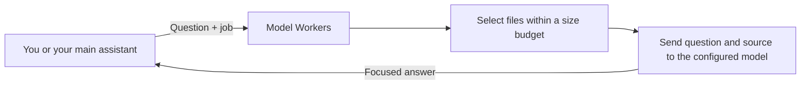

# Model Workers

Choose an AI model for each job, then call it through one small command.

For example: a reading model explains your payment code, a reviewing model looks for bugs, and a writing model drafts a change. Your main assistant can call the same commands and use the results in your conversation.

This is a small, inspectable starting point: Node.js 20+, no npm dependencies, and adapters for the Codex and Claude Code CLIs. It also includes a demo that needs no account or API key.



The worker reads the selected source. The main assistant receives its answer. To reduce source entering the main assistant's context, call the worker **before** the main assistant reads those files.

## Try the demo

```bash
git clone https://github.com/Shanmuud/model-workers.git
cd model-workers
npm test
node bin/model-workers.mjs explain \
  --repo examples/payment-app \
  --path payments.js \
  --question "What happens when a payment fails?" \
  --provider demo
```

The demo returns a clearly labeled, canned answer. It does not call AI, require credentials, or demonstrate model quality or cost savings.

You can run the CLI with `node bin/model-workers.mjs`, or run `npm link` to make `model-workers` available as a command.

## Choose real models

Install and authenticate the provider's CLI first. Model Workers uses that CLI's existing authentication; do not put credentials in this repository.

The adapters require recent CLIs with the flags they use. They were checked
against Codex 0.153.4 and Claude Code 2.1.226. Codex uses OpenAI authentication;
custom providers that depend on a user config are not supported by this adapter.

Pass a provider and model directly:

```bash
node bin/model-workers.mjs explain \
  --repo /absolute/path/to/your-project \
  --question "How does login work? Include relevant file and function names." \
  --provider claude \
  --model YOUR_CLAUDE_MODEL \
  --dry-run
```

Replace `YOUR_CLAUDE_MODEL` with a model identifier available to your account. The dry run lists selected paths, sizes, and routing information without sending source or making a model call. Remove `--dry-run` to run the worker.

For reusable routing, copy `workers.example.json` to `workers.local.json`, replace its model placeholders, and choose your providers. The format is:

```bash
cp workers.example.json workers.local.json
```

```json
{
  "version": 1,
  "workers": {
    "explain": { "provider": "claude", "model": "YOUR_READING_MODEL" },
    "review": { "provider": "codex", "model": "YOUR_REVIEW_MODEL" },
    "draft": { "provider": "codex", "model": "YOUR_CODING_MODEL" }
  }
}
```

The names above are placeholders, not model recommendations. Choose the models you want to use, then pass the configuration explicitly:

```bash
node bin/model-workers.mjs explain \
  --repo /absolute/path/to/your-project \
  --config /absolute/path/to/workers.local.json \
  --question "What happens when a payment fails?"
```

The program does not load a project's configuration automatically. Each real call needs an explicitly selected provider and model, supplied through flags or the specified config.

## Three jobs

| Command | Use it for | Result |
| --- | --- | --- |
| `explain` | Understanding behavior in selected source | An explanation with source references |
| `review` | Asking about bugs or risks in selected source | Findings and supporting evidence |
| `draft` | Proposing code from a specification and reference files | Text you can inspect and apply yourself |

`review` reviews the files you provide; it is not automatically a review of a Git diff. `draft` returns proposed text; the worker does not edit your project.

For a focused review:

```bash
node bin/model-workers.mjs review \
  --repo /absolute/path/to/your-project \
  --path src/payments.js \
  --path tests/payments.test.js \
  --config /absolute/path/to/workers.local.json \
  --question "Can a failed payment be charged twice? Explain the evidence."
```

For a draft saved to a new file:

```bash
node bin/model-workers.mjs draft \
  --repo /absolute/path/to/your-project \
  --path tests/payments.test.js \
  --config /absolute/path/to/workers.local.json \
  --question "Draft tests for exhausted retries, following the supplied test style." \
  --output proposed-tests.md
```

`--output` checks the destination before calling the provider, then creates the file after a successful response without overwriting existing files. A failed worker request creates no output file. Drafts are not automatically applied, reviewed, or tested.

## Files and limits

By default, the CLI considers Git-tracked text files and excludes common secret files, generated files, and dependency directories. It prioritizes README files and paths containing words from your question. This is a simple file-selection heuristic, not semantic repository search or an exhaustive investigation.

Use repeated `--path` options for precise input; each selects a file, not a directory or glob. Explicit paths are required outside a Git repository. Paths must stay inside the repository; paths escaping it, symlinks, common secret files, binary files, and oversized explicit inputs are rejected. The defaults are 120,000 source bytes and 40 files. Run `--dry-run` to inspect what will be included.

| Option | Purpose |
| --- | --- |
| `--repo PATH` | Project to read |
| `--question TEXT` | Task and any context the worker needs |
| `--path RELATIVE` | Select a file; repeat for multiple files |
| `--provider codex\|claude\|demo` | Select an adapter |
| `--model MODEL` | Select the provider's model identifier |
| `--config PATH` | Read an explicitly chosen routing config |
| `--dry-run` | Inspect file selection and routing without a model call |
| `--json` | Return a structured result for another program |
| `--output FILE` | Save the answer to a new file |
| `--max-bytes N` | Limit total source bytes; default 120,000, maximum 1,000,000 |
| `--max-files N` | Limit selected file count; default 40, maximum 200 |
| `--timeout SECONDS` | Provider deadline; default 120, maximum 900 |

## Let your main assistant call it

Give the main assistant an absolute path to the CLI and an explicit routing config. Then describe which jobs to delegate. [Copyable agent instructions](docs/agent-instructions.md) provide a starting point.

Every worker call is independent. The worker does not inherit the main conversation, so the question must include relevant requirements. By default, the final answer goes to standard output and status messages go to standard error. `--json` returns a structured result containing the answer and metadata. With `--output`, the file receives the answer and the command reports its path instead. Dry runs always return selection metadata as JSON.

The adapters use temporary working directories and restricted CLI settings: Claude runs in safe mode with tools disabled; Codex uses its read-only sandbox and ignores user configuration. These settings are not complete isolation from the host filesystem. Source selection also cannot guarantee that arbitrary source files contain no sensitive content. Review the selected files before sending private code to a provider.

## What this demonstrates

A useful worker answer can be much smaller than its source. That can reduce source text reaching your main model. The worker still consumes tokens, and verification can add more. The `estimated_source_tokens` and `estimated_answer_tokens` fields use bytes divided by four; the source estimate excludes prompt instructions and formatting. These estimates are not billing measurements. `provider_usage` includes available token counts reported by the provider. This project makes no fixed percentage savings claim.

CLI workers also load their own system instructions and tool definitions, which
can be much larger than a small source bundle. Compare actual provider usage
when available; tiny tasks are unlikely to benefit from this extra invocation.

## Validation and platform support

Run `npm test` for the credential-free tests, including simulated provider
processes, source selection, output handling, timeouts, and cancellation.
GitHub Actions runs the suite on Linux with Node.js 20, 22, and 24.

The Codex adapter has also completed a live smoke test on the included payment
example. A successful live Claude request has not yet been verified; its adapter
is covered by the simulated transport tests. The project targets Linux/macOS;
only Linux has been exercised. Windows provider execution is unverified and
would need handling for Windows command wrappers.

Inspired by [Spotify's article about delegating bulk work](https://engineering.atspotify.com/2026/9/portal-by-spotify-cut-my-claude-code-token-usage-by-90). This project is independent of Spotify and does not require Portal.

- [How the script is built, with a payment example](docs/how-it-works.md)
- [Instructions for your main assistant](docs/agent-instructions.md)
- [Excalidraw layout and social post draft](docs/social-post.md)
- Provider references: [Codex non-interactive mode](https://learn.chatgpt.com/docs/non-interactive-mode), [Claude Code programmatic use](https://code.claude.com/docs/en/headless)
